\newpage

# Antes de começar

O **Avião** é o sistema de chamados da Quality Sistemas. Ele substitui o antigo
SAC e reúne num lugar só tudo o que antes ficava espalhado: abertura e triagem
de chamados, acompanhamento do desenvolvimento, visitas técnicas, atendimento
por WhatsApp, indicadores e a trilha de auditoria exigida pela LGPD.

Este manual foi escrito para quem **nunca abriu o sistema**. Começa pelo básico,
mostra cada tela com uma imagem real e só depois entra nos assuntos de
administração. Você pode ler do começo ao fim ou pular direto para o capítulo do
seu dia a dia pelo sumário.

## As três partes do sistema

Você vai ouvir esses três nomes; vale saber a diferença desde já:

| Parte | Onde fica | Para que serve |
|---|---|---|
| **Aplicativo** | `http://10.1.2.12` | Onde o trabalho acontece: chamados, atendimento, visitas, indicadores. |
| **Configurações do espaço de trabalho** | Menu do usuário → *Configurações* | Regras da equipe: quem entra, o que cada função pode fazer, SLA, entidades, impressão, auditoria. |
| **God-mode** | `http://10.1.2.12/god-mode` | Painel da instalação: e-mail, formas de login, IA, espaços de trabalho. Só administradores da instância. |

## O vocabulário

O sistema nasceu de uma base internacional e foi inteiramente traduzido. Estes
termos aparecem o tempo todo:

| Termo | O que é |
|---|---|
| **Chamado** | A unidade de trabalho. Todo pedido, bug, dúvida ou melhoria vira um chamado. |
| **Sistema** (ou projeto) | Cada produto da Quality — Contabilidade, Siart, Folha de Pagamento… Um chamado sempre pertence a um sistema. |
| **Solicitação** | Um pedido que ainda **não** foi triado. Só vira chamado quando alguém aceita. |
| **Entidade** | O cliente atendido (prefeitura, câmara, consórcio, instituto). |
| **Etapa** | A coluna do quadro: Triagem, Em Análise, A Fazer, Em Desenvolvimento, Em Teste, Concluído — mais Pendências e Cancelado, fora do caminho normal. |
| **Responsável** | Quem tem de resolver o chamado agora. |
| **Ciclo** | Uma janela de tempo (sprint) com um conjunto de chamados. |
| **Módulo** | Um agrupamento temático de chamados dentro de um sistema. |
| **Espaço de trabalho** | A Quality inteira dentro do sistema. Você só tem um. |

## Como o trabalho flui

```
  Solicitação ─► Triagem ─► Em Análise ─► A Fazer ─► Em Desenvolvimento ─► Em Teste ─► Concluído
   (cliente,     (Qualidade,  (Qualidade,   (fila           (TI)             (Qualidade)
    atendimento,  sem dono)    com dono)     do TI)
    WhatsApp)
```

Fora desse caminho existem mais duas etapas: **Pendências**, para o que foi
aceito mas ainda não entrou na fila, e **Cancelado**, para o que não vai ser
feito.

**Triagem é a fila do que ainda não tem dono.** Um chamado fica em Triagem
enquanto ninguém da Qualidade o assumiu; assim que alguém entra como
responsável, ele passa para **Em Análise**. Não é o tipo do chamado nem o
cliente que define — é ter ou não um responsável.

Quem pode mover o chamado de uma etapa para outra depende do **papel** da
pessoa. Veja [Funções e permissões](#funções-e-permissões).

\newpage

# Entrar no sistema

A entrada tem dois passos: primeiro o e-mail, depois a senha.

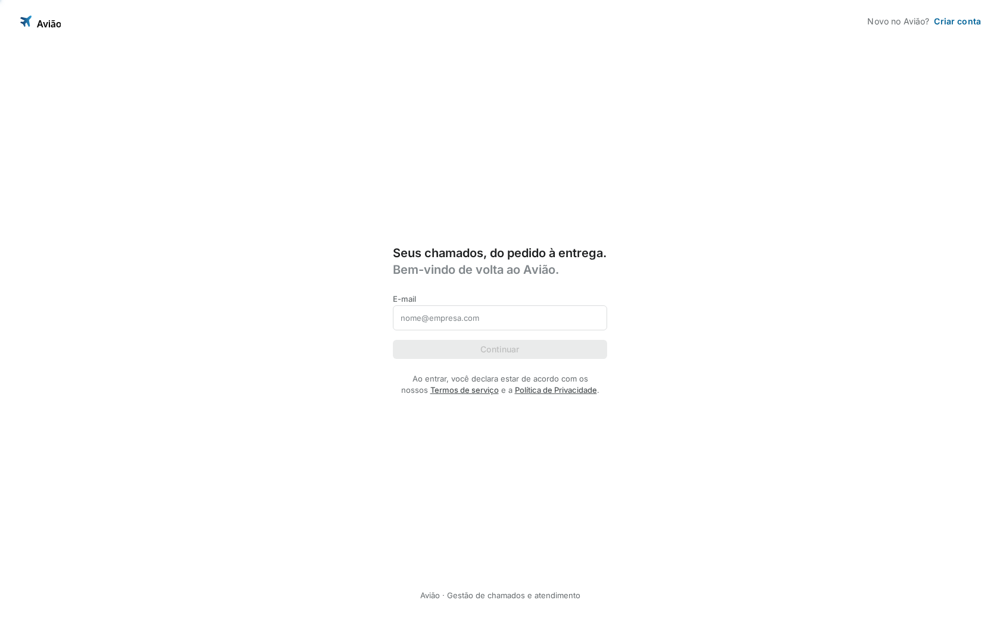

Digite o e-mail corporativo e pressione **Enter** — não precisa clicar no botão.
O sistema reconhece a conta e pede a senha.

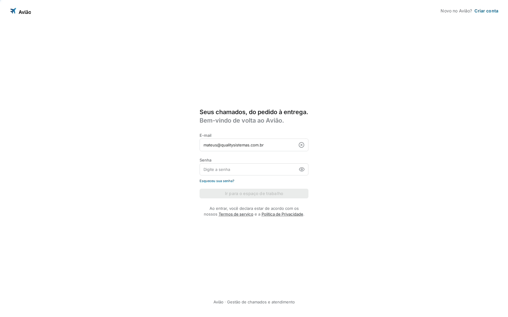

> **Esqueceu a senha?** Use *Esqueci minha senha* na segunda tela. Se o e-mail
> não chegar, qualquer administrador redefine em **Configurações → Membros**.

\newpage

# Página inicial

É a primeira tela depois de entrar, e ela responde "o que eu faço agora?".

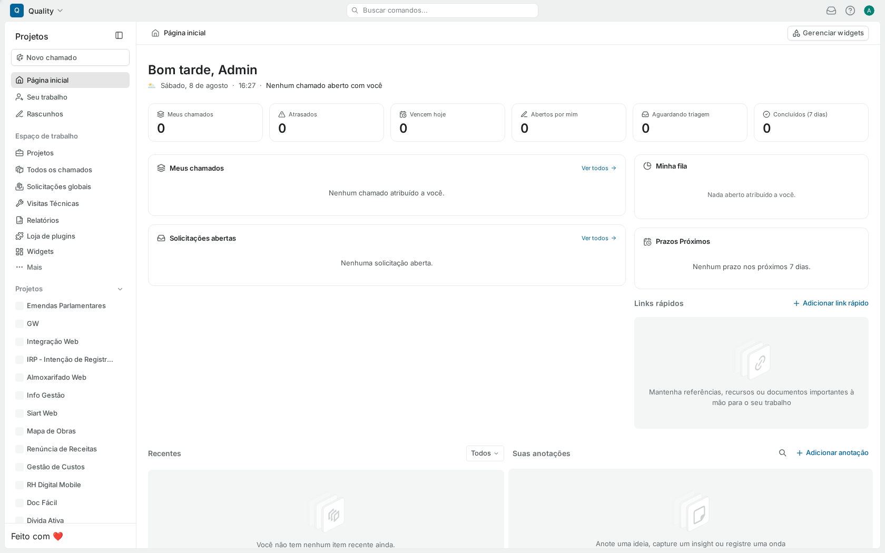

A saudação traz a data, a hora e **uma frase sobre o seu dia** — quantos
chamados passaram do prazo, quantos vencem hoje ou quantos estão com você.

## A faixa de indicadores

Seis números clicáveis. Clicar em qualquer um leva à listagem já filtrada.

| Indicador | O que conta |
|---|---|
| **Meus chamados** | Tudo em aberto atribuído a você |
| **Atrasados** | Seus chamados com prazo vencido — fica vermelho quando há algum |
| **Vencem hoje** | Seus chamados com prazo para hoje |
| **Abertos por mim** | O que você abriu e ainda está em aberto |
| **Aguardando triagem** | Solicitações esperando resposta nos seus sistemas |
| **Concluídos (7 dias)** | O que a equipe entregou na última semana |

Todos contam **apenas dentro dos sistemas de que você participa**: a página
inicial é a sua visão do dia, não um painel da empresa inteira.

## As duas colunas

À esquerda fica o que exige ação — **Passaram do prazo** (aparece só quando há
algo atrasado), **Meus chamados** e **Solicitações abertas**. À direita, o
contexto: **Minha fila** (uma barra com a distribuição por etapa e por
prioridade), **Prazos próximos** e os **Links rápidos**.

## O banner de chamados urgentes

Quando existe chamado com prioridade **Urgente** em aberto, uma faixa aparece no
topo de todas as telas com o código e o título. Ela some quando o chamado deixa
de ser urgente ou é concluído; o **×** apenas a esconde na sessão atual.

**Dicas**

- **Minha fila** responde "onde a minha fila travou": tudo parado em Triagem é
  um problema diferente de tudo parado em Em Teste, e o total sozinho não conta
  isso.
- **Gerenciar widgets**, no canto superior direito, liga e desliga os blocos
  opcionais (recentes, notas, links).
- A barra lateral tem duas seções: **Espaço de trabalho** (visões que cruzam
  todos os sistemas) e **Projetos** (a lista de sistemas). O item **Mais**
  revela o restante do menu.

\newpage

# Sistemas (projetos)

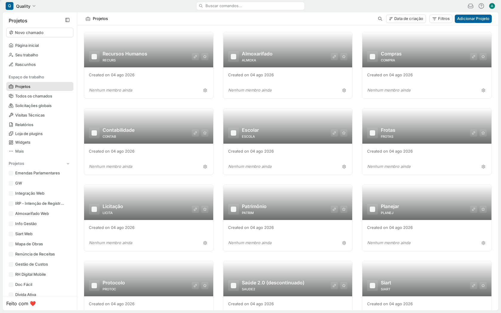

Cada produto da Quality é um sistema. A lista mostra todos, com os que você
acompanha marcados. Clique no nome para entrar; clique na estrela para fixá-lo
nos favoritos da barra lateral.

**Dicas**

- Um sistema só aparece na sua barra lateral se você for membro dele. Peça
  acesso a um administrador em **Configurações → Membros**.
- Sistemas descontinuados continuam no ar para consulta (ex.: *DMS
  (descontinuado)*). O histórico do SAC foi migrado inteiro, então chamado
  antigo continua pesquisável.

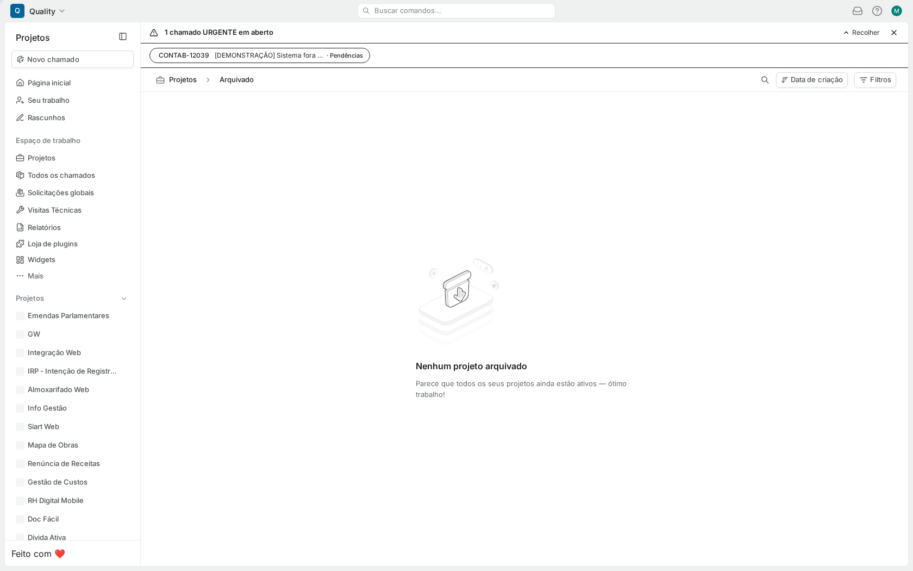

\newpage

# Abrir um chamado

O botão **Novo chamado** (barra lateral) e **Adicionar chamado** (topo da
listagem) abrem a mesma janela.

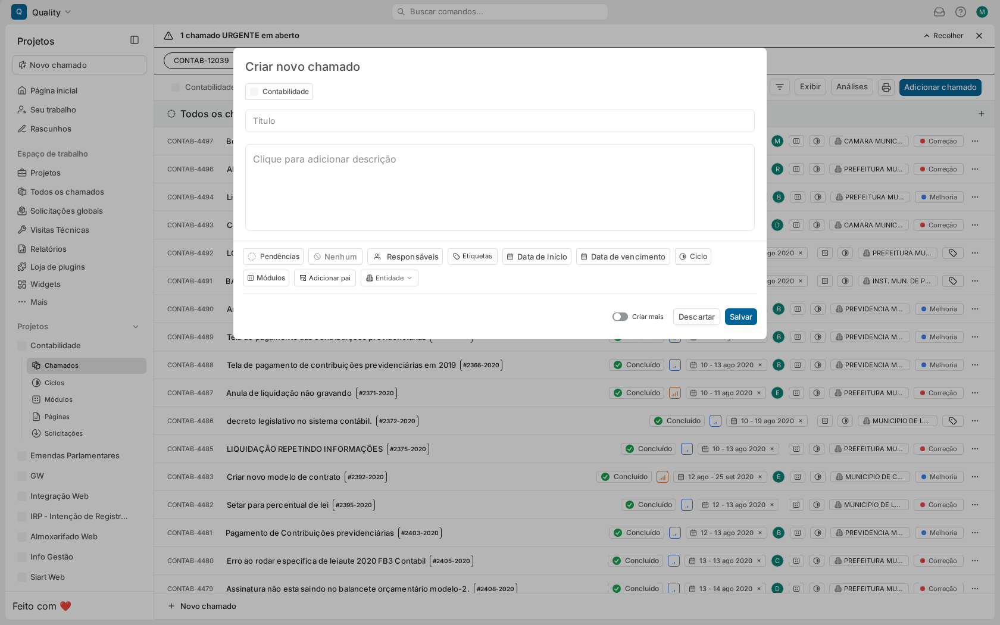

De cima para baixo:

1. **Sistema** — em qual produto o chamado entra. Vem preenchido com o sistema
   em que você está.
2. **Título** — uma frase curta que identifique o problema. É o que todo mundo
   lê na listagem, então prefira "Anexo 14 não gera no balanço" a "erro".
3. **Descrição** — o relato completo. Aceita formatação e anexos (a seguir).
4. **Propriedades** — a fileira de botões: Estado, Prioridade, Responsáveis,
   Etiquetas, Data de início, Data de vencimento, Ciclo, Módulos, chamado Pai e
   Entidade. Todos são opcionais e podem ser preenchidos depois.
5. **Criar mais** — deixe ligado para a janela continuar aberta depois de
   salvar, útil ao cadastrar vários chamados em sequência.

> **Etiqueta define prazo.** Ao escolher *Correção* ou *Melhoria*, a data de
> vencimento é preenchida sozinha conforme o [SLA](#sla--prazos) — desde que
> você ainda não tenha informado uma data à mão.

## O editor de texto

A descrição e os comentários usam o mesmo editor.

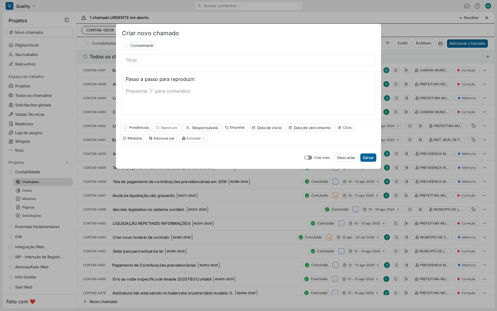

A barra oferece **negrito**, *itálico*, sublinhado, riscado, alinhamento, lista
numerada, lista com marcadores, citação, tabela, bloco de código e imagem.

O que mais economiza tempo:

- **Colar imagem direto** (`Ctrl + V`) — um print da tela de erro vai para
  dentro da descrição sem precisar salvar arquivo antes.
- **Arrastar e soltar** um arquivo sobre o editor anexa o arquivo.
- **Colar um link de vídeo** insere o vídeo embutido.
- **`/`** abre o menu de blocos (título, lista, código, tabela…).
- **`@`** menciona uma pessoa — ela recebe notificação.
- **Markdown funciona**: `**negrito**`, `- ` para lista, `1. ` para lista
  numerada, crase tripla para bloco de código.

Para **arquivos grandes** (planilhas, bancos, logs), prefira o botão **Anexar**
na tela do chamado: o anexo fica listado à parte e é mais fácil de achar depois.

\newpage

# Chamados de um sistema

É a tela onde o dia passa. Ela tem **cinco layouts** para os mesmos dados —
escolha o que responde à sua pergunta. Os cinco ícones no topo trocam entre eles.

## Lista

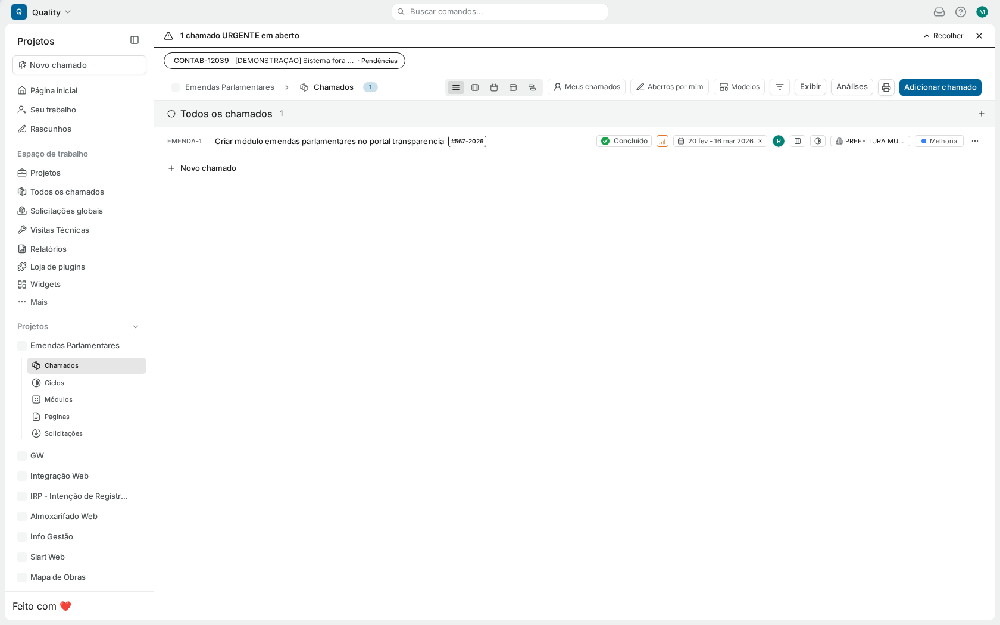

O layout mais denso: uma linha por chamado, com estado, prazo, responsáveis,
entidade e etiqueta **editáveis direto na linha** — não é preciso abrir o
chamado para mudar a prioridade ou o responsável.

Por padrão vem **agrupada por etapa**, com a contagem ao lado de cada título. O
agrupamento se troca em **Exibir**.

Cada chamado tem dois identificadores:

- **CONTAB-130** — o código do Avião (sigla do sistema + número sequencial).
- **#710-2026** — o número do chamado no **SAC antigo**, preservado na migração.
  Use-o quando o cliente citar o número velho.

## Quadro (kanban)

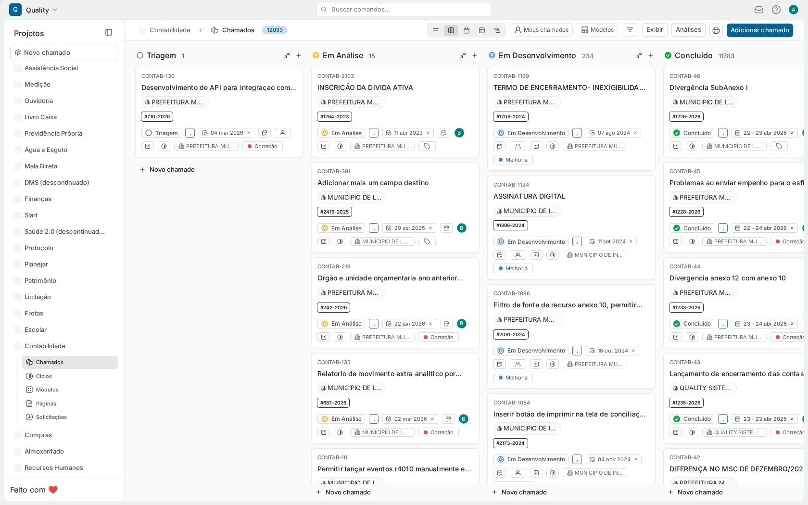

Uma coluna por etapa, com a contagem ao lado do nome. Arraste o cartão para
mover o chamado — se o seu papel não permitir aquela transição, o sistema recusa
e explica o porquê.

Repare: os cartões em **Triagem** não têm avatar de responsável, e todos os de
**Em Análise** têm. É a regra do fluxo aparecendo na tela.

> **Todo mundo vê tudo.** Antes, cada setor só enxergava as etapas que lhe
> diziam respeito (o TI não via a Triagem). Isso acabou: quem participa do
> sistema vê todas as etapas. Para trabalhar só no que interessa, use os filtros.

## Calendário

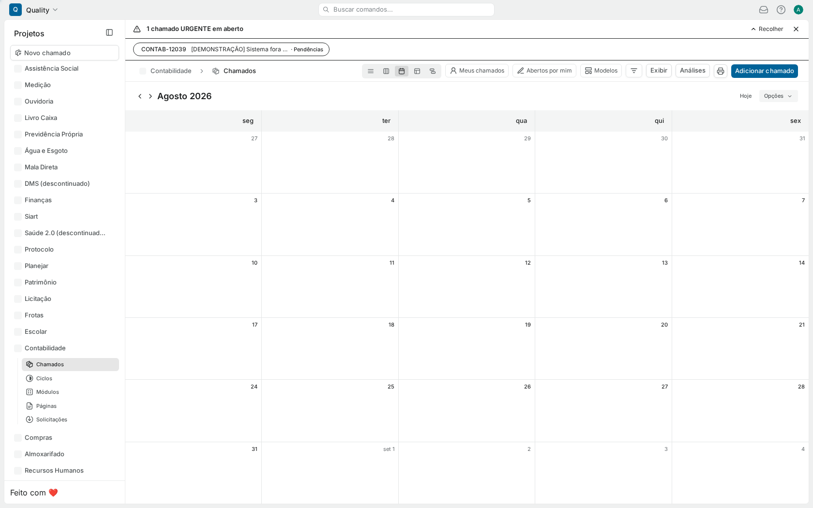

Distribui os chamados pela data de entrega. Útil para enxergar acúmulo de prazo
numa semana e redistribuir antes de estourar.

## Planilha

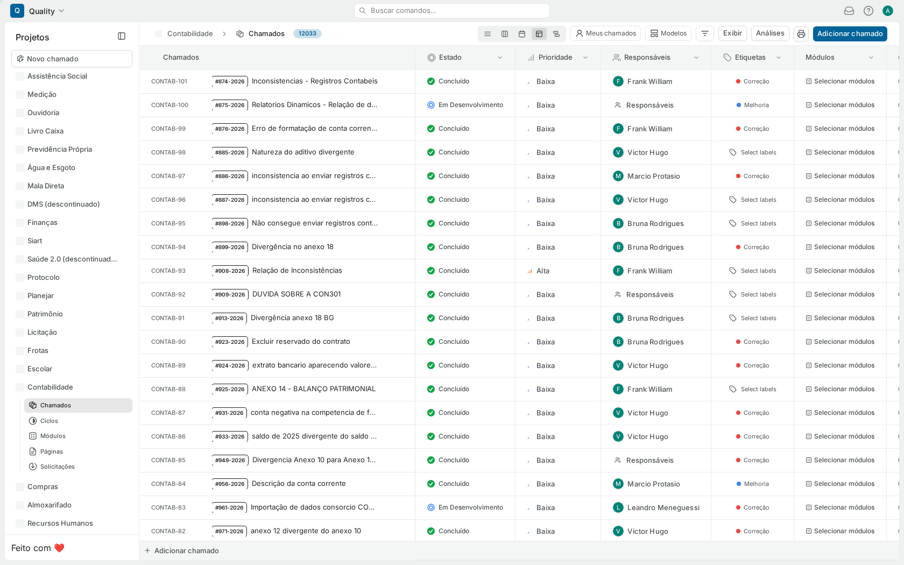

Uma coluna por propriedade, como uma tabela. É o layout certo para conferir
muitos campos ao mesmo tempo e para exportar.

## Linha do tempo

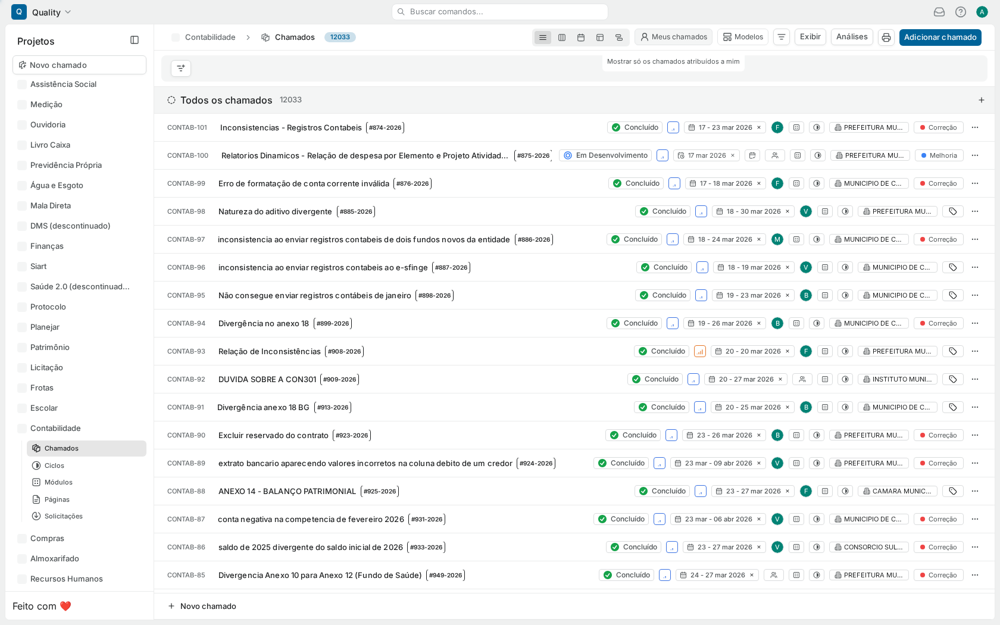

Mostra a duração de cada chamado entre a data de início e a de entrega.

**Dicas**

- O layout escolhido **fica salvo por sistema**: kanban na Contabilidade e lista
  no Siart, e o Avião lembra.
- **Exibir** controla agrupamento, ordenação e quais propriedades aparecem.
- O ícone de impressora imprime o que está na tela, com o filtro aplicado.

\newpage

# Filtrar

## Só o que é meu

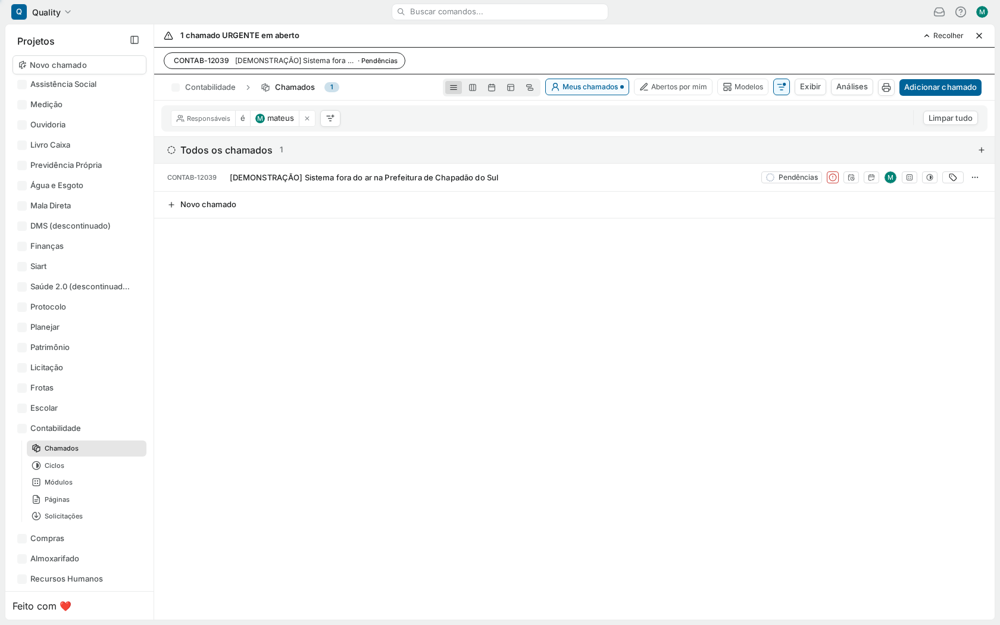

Os dois primeiros botões da barra são interruptores:

| Botão | Mostra |
|---|---|
| **Meus chamados** | O que está **atribuído a você** — o que você tem de resolver. |
| **Abertos por mim** | O que **você abriu**, esteja com quem estiver agora. |

Ligado, o botão fica azul com um ponto ao lado; desligado volta ao cinza. Eles
existem em **todas as telas de listagem** — chamados do sistema, ciclo, módulo,
visualizações salvas, visões globais e arquivados — em qualquer layout e também
no celular, onde ficam só com o ícone.

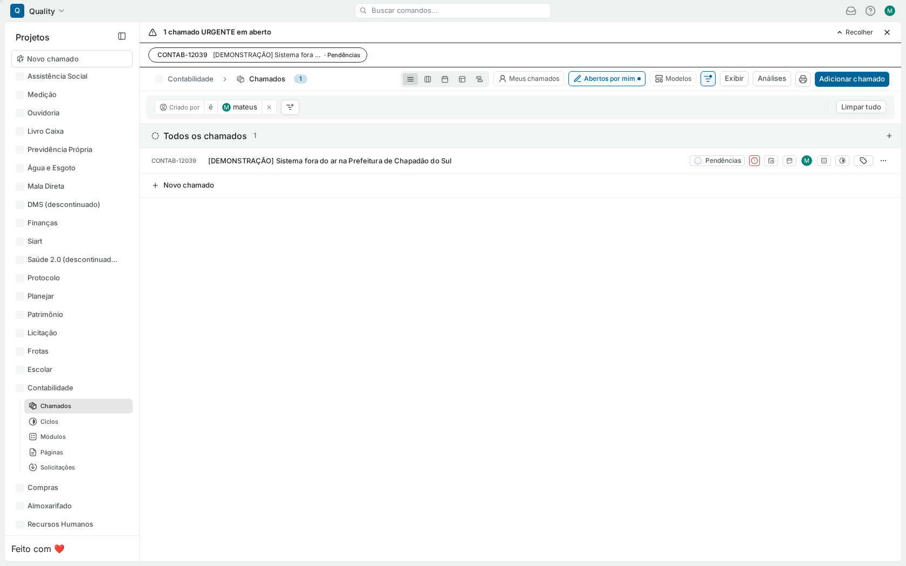

Os dois respondem perguntas diferentes, por isso existem separados: a Qualidade
e o Atendimento abrem muito chamado que depois fica com outra pessoa.

> **Meu chamado é o que eu tenho de resolver.** O responsável é quem está com o
> chamado agora: se você é do TI e puxou o cartão para Em Desenvolvimento, ele é
> seu. Ter comentado num chamado não faz dele seu — para acompanhar sem ser o
> responsável, use a inscrição (o sino no detalhe do chamado).

## A barra de filtros

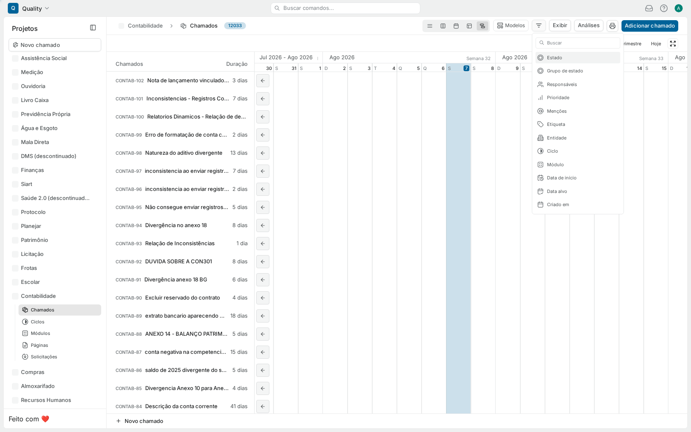

Clique no funil para montar um filtro. Escolha o **campo** (Estado, Grupo de
estado, Responsáveis, Prioridade, Menções, Etiqueta, Entidade, Ciclo, Módulo,
Data de início, Data alvo, Criado em), depois o **operador** e o **valor**.

| Operador | Significado |
|---|---|
| **é** | Casa exatamente com o valor. |
| **é um de** | Casa com qualquer valor da lista. |
| **entre** | Para datas: dentro do intervalo, inclusive as bordas. |

## Modelos por setor

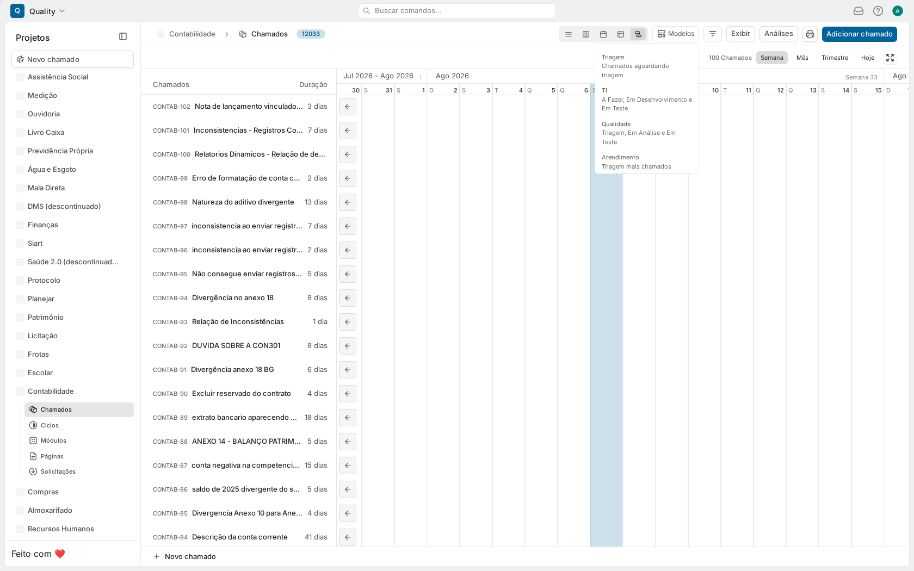

O botão **Modelos** aplica, num clique, o recorte típico de cada setor:

| Modelo | Mostra |
|---|---|
| **Triagem** | Chamados da Qualidade ainda sem responsável |
| **TI** | A Fazer, Em Desenvolvimento e Em Teste |
| **Qualidade** | Triagem, Em Análise e Em Teste |
| **Atendimento** | Triagem e os chamados que o setor acompanha |
| **Em andamento** | Tudo que já foi iniciado |
| **Concluídos** | Chamados já finalizados |

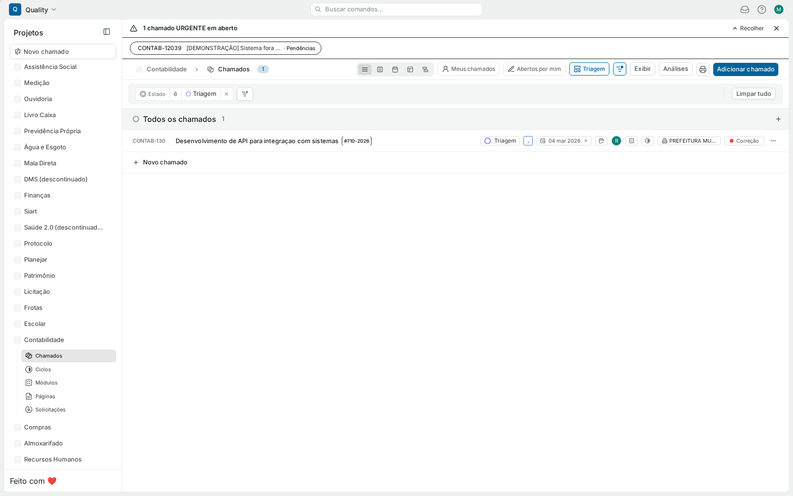

A diferença entre modelo e interruptor importa:

- o **modelo** substitui o filtro inteiro;
- os **interruptores** apenas acrescentam você, preservando o resto.

Aplique o modelo do seu setor e ligue **Meus chamados** para ficar só com a sua
parte daquele recorte. Desligar devolve o filtro do setor intacto.

\newpage

# O chamado por dentro

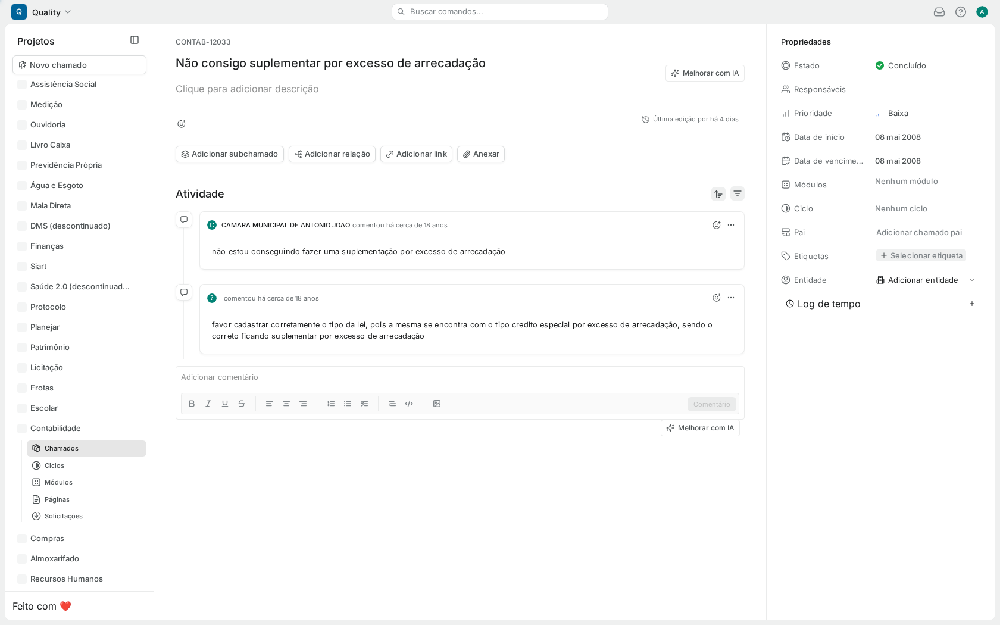

A tela tem três áreas:

1. **Centro** — título, descrição e a linha do tempo de atividade (comentários e
   mudanças).
2. **Direita (Propriedades)** — Estado, Responsáveis, Prioridade, Data de
   início, Data de vencimento, Módulos, Ciclo, chamado Pai, Etiquetas, Entidade
   e Log de tempo.
3. **Barra de ações** — Adicionar subchamado, Adicionar relação, Adicionar link,
   Anexar.

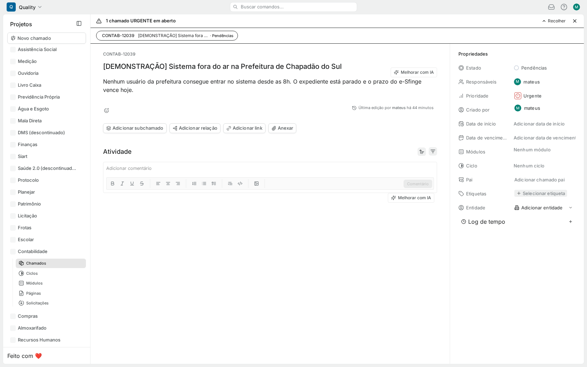

**Dicas**

- **Subchamado** divide um trabalho grande; **relação** liga chamados
  independentes (duplicado, bloqueia, relacionado a).
- Comentários aceitam formatação, imagens coladas e arquivos. Use `@` para
  mencionar alguém.
- Comentários podem ser **editados e apagados**; quando editados, aparece
  *(editado)* com o histórico de versões.
- Todo o histórico do SAC foi migrado. **O primeiro post do chamado antigo virou
  a descrição**, e os demais viraram comentários com a data original — por isso é
  comum ver "comentou há cerca de 18 anos".
- **Log de tempo** registra as horas trabalhadas.
- O menu **…** traz **Arquivar**, que tira o chamado das listagens sem apagá-lo.

## Arquivados

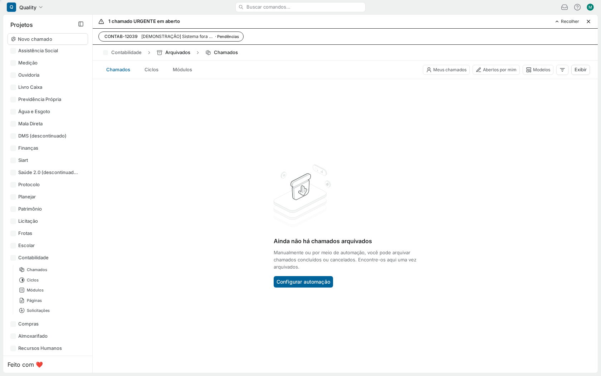

Chamado arquivado some da listagem normal e fica aqui, de onde pode ser
restaurado. Arquivar exige a mesma permissão de editar.

\newpage

# Solicitações

Tudo o que chega de fora — cliente, atendimento, WhatsApp — entra como
**solicitação** e espera triagem.

## Visão global

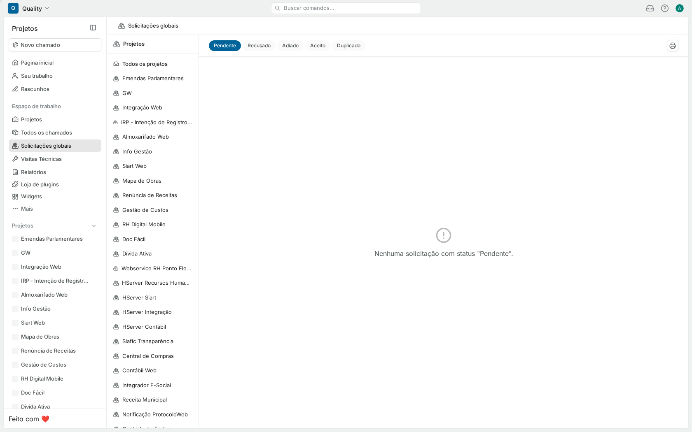

As abas separam por situação: **Pendente**, **Recusado**, **Adiado**, **Aceito**
e **Duplicado**. A coluna da esquerda filtra por sistema; *Todos os projetos*
mostra a fila inteira.

## Solicitações de um sistema

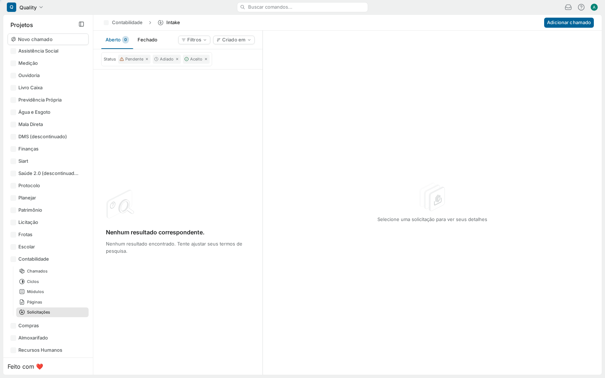

O mesmo, restrito ao sistema aberto.

## Abrir uma solicitação

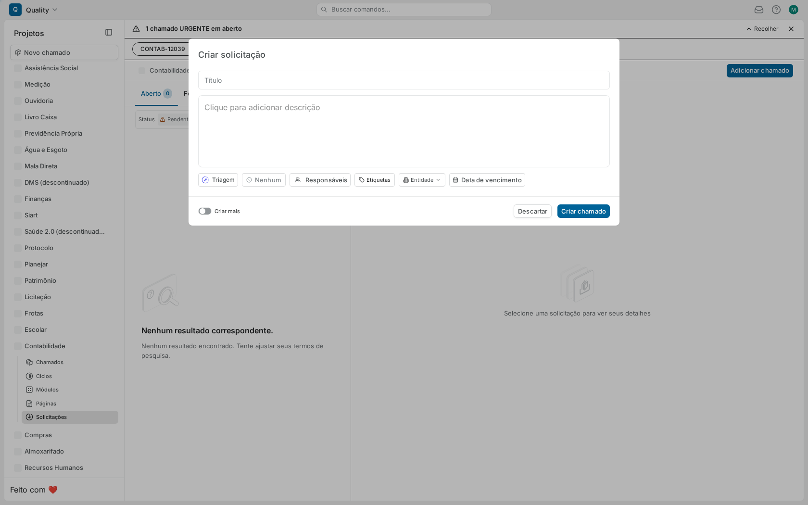

O formulário é mais curto que o de chamado de propósito: quem abre a solicitação
normalmente é quem atende o cliente, e o detalhamento vem na triagem.

**Dicas**

- **Aceitar** transforma a solicitação em chamado e o coloca na Triagem.
  **Recusar** e **Duplicado** encerram sem criar chamado — justifique no
  comentário, porque o solicitante recebe a resposta.
- Uma solicitação atendida na hora (sem virar chamado) pode ser marcada como
  **atendida**.

\newpage

# Visitas técnicas

O módulo de visitas guarda o registro das idas a campo: quem foi, quando, a que
entidade, o que foi feito e o que ficou pendente.

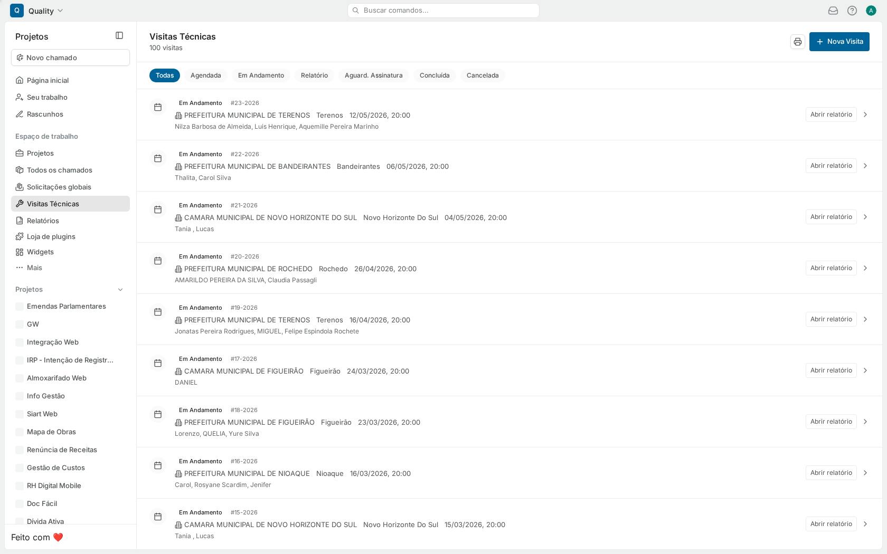

A listagem traz número, entidade, município, período, técnico responsável e
situação. Todo o histórico de visitas do SAC foi migrado — são 861 registros.

## Uma visita por dentro

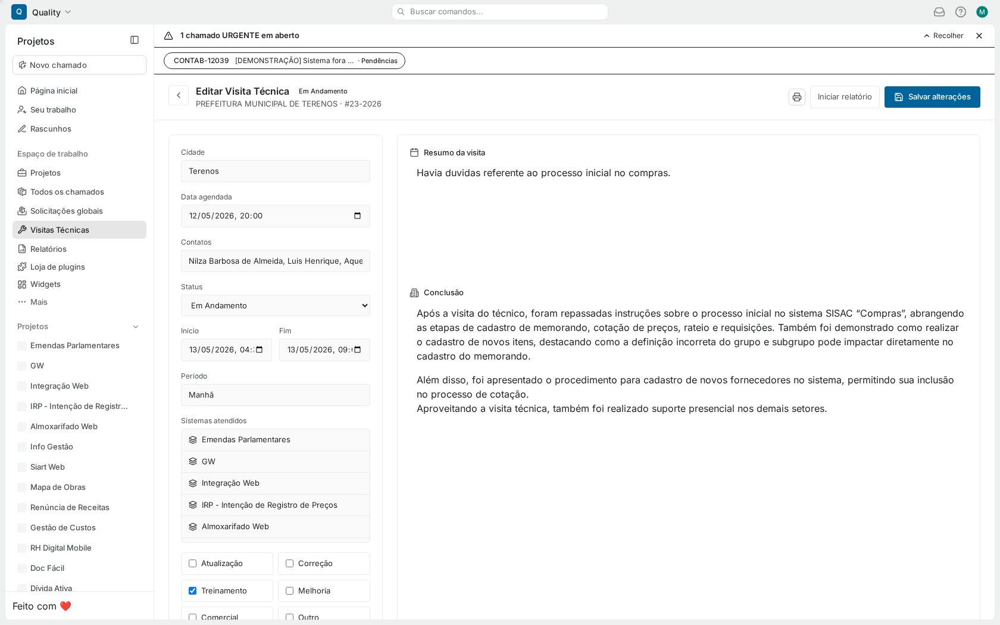

Uma visita reúne:

| Campo | Para que serve |
|---|---|
| **Número** | Identificador da visita, herdado do SAC quando migrada. |
| **Entidade** | O cliente visitado. Vem do primeiro contato listado. |
| **Município** | Onde a visita aconteceu. |
| **Período** | Datas programada e executada. |
| **Técnico responsável** | Quem foi a campo (pode haver um segundo técnico). |
| **Responsáveis** | Quem recebeu o técnico. Escolhidos entre os [Contatos](#contatos) da entidade, com cadastro na hora para quem ainda não existe. |
| **Sistemas** | Quais produtos foram tratados na visita. |
| **Resumo e conclusão** | O relato do que foi feito e o desfecho. |
| **Motivos** | Classificação do porquê da visita. |
| **Situação** | Programada, executada ou cancelada. |

**Dicas**

- Uma visita pode ser **vinculada a chamados**: o relatório da visita e o
  histórico do chamado passam a se referenciar, o que evita explicar duas vezes
  a mesma coisa.
- A tela **imprime** com o logo configurado — é o relatório que fica com o
  cliente. Veja [Impressão](#impressão).
- A visita registra **datas programada e executada separadas**. Preencher as
  duas é o que permite medir atraso de agenda depois.

\newpage

# Contatos

O menu **Contatos** guarda as pessoas de carne e osso dentro de cada cliente: o
prefeito, o secretário, o técnico de T.I. da prefeitura, o usuário do sistema.
Antes elas eram redigitadas a cada visita, sem telefone e sem e-mail; agora são
cadastro, com histórico. Os 2.433 responsáveis do SAC foram migrados.

O menu fica no mesmo nível de Atendimento e **está aberto a todo mundo** — o
cadastro nasce no encerramento de um atendimento ou no meio de uma visita, feito
por quem está em campo.

A listagem tem busca por **nome, e-mail ou telefone** e filtros por **entidade**,
**tipo** (o papel da pessoa no órgão) e **situação** (ativos, inativos ou os
dois). Cada linha permite editar e desativar. Desativar não apaga: o contato sai
das listas de escolha mas continua no histórico das visitas em que aparece.

**Onde mais eles aparecem**

- Na tela de **Entidades** (Configurações → Entidades), ao editar uma entidade,
  a lista dos contatos dela fica ali mesmo, com cadastro e edição no lugar.
- Na **visita técnica**, no campo Responsáveis — inclusive com o botão
  *Cadastrar contato* para quem recebeu o técnico e ainda não existe no sistema.

**Dica** — os contatos migrados do SAC como texto solto continuam visíveis na
visita, em uma linha própria. Não dá para reconstituí-los em pessoas, então eles
convivem com os responsáveis escolhidos.

\newpage

# Ciclos e módulos

## Ciclos

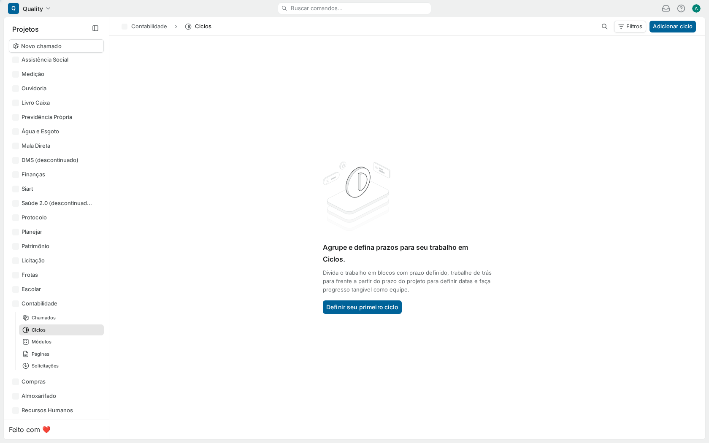

Um ciclo é uma janela de tempo com início e fim. Responde "o que entra nesta
semana/quinzena" e mede o que efetivamente saiu.

## Módulos

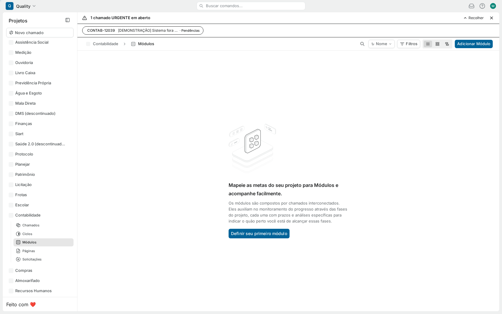

Um módulo agrupa chamados por tema, sem prazo. Ex.: "Fechamento anual",
"e-Sfinge", "Migração de anexos".

> Ciclo é **quando**; módulo é **sobre o quê**. Um chamado pode estar em um
> ciclo e em vários módulos ao mesmo tempo.

\newpage

# Visões globais e visualizações

## Visão global

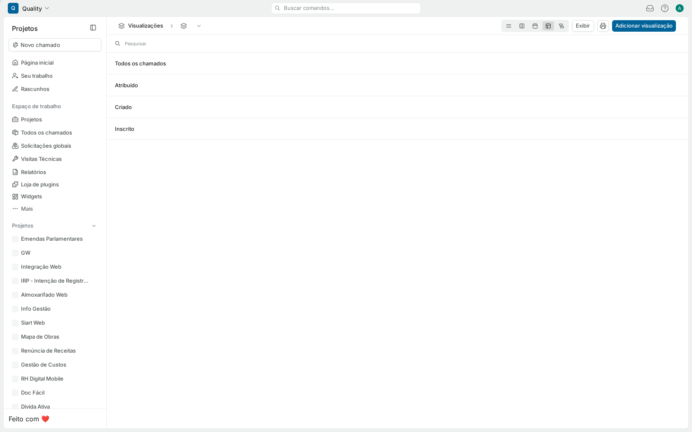

Cruza **todos os sistemas** de uma vez: "tudo atribuído a mim", "tudo que vence
esta semana", "tudo de uma entidade".

## Visualizações salvas

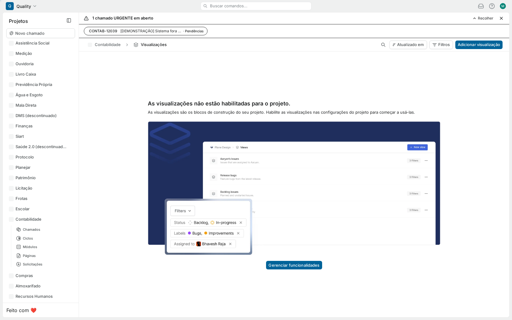

Uma combinação de filtros guardada com nome, dentro de um sistema. Serve para
recortes que a equipe consulta sempre.

\newpage

# Análises

## Visão geral

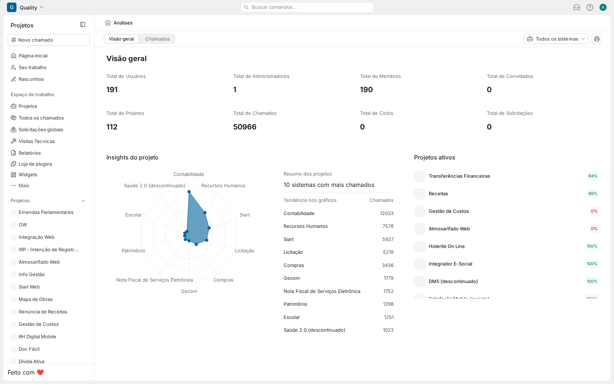

Os cartões do topo somam o espaço de trabalho: usuários, administradores,
membros, convidados, sistemas, chamados, ciclos e solicitações.

O radar **Insights do projeto** compara os **10 sistemas com mais chamados** —
com mais de uma centena de sistemas, o gráfico completo ficaria ilegível. A
lista ao lado traz os números exatos. À direita, **Projetos ativos** mostra o
percentual de conclusão de cada sistema.

## Aba de chamados

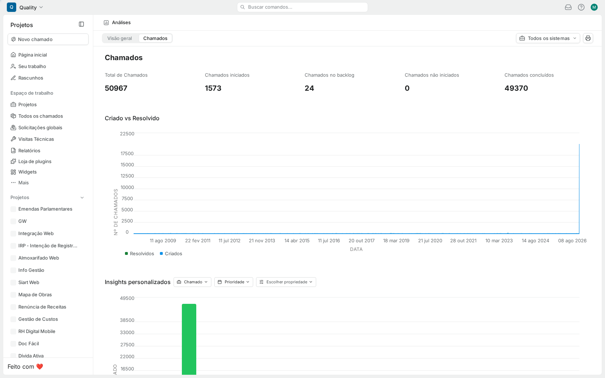

- **Contadores por grupo de etapa**: total, iniciados, no backlog, não iniciados
  e concluídos.
- **Criado vs Resolvido**: a série histórica. Onde a linha de criados sobe acima
  da de resolvidos, a fila cresceu.
- **Insights personalizados**: você escolhe o eixo (Etapa, Grupo de etapa,
  Prioridade, Etiqueta, Responsável, Ciclo, Módulo, datas) e a métrica.

O seletor **Todos os sistemas**, no topo, restringe tudo a um subconjunto, e o
ícone de impressora gera o relatório com os gráficos como estão na tela.

\newpage

# Relatórios

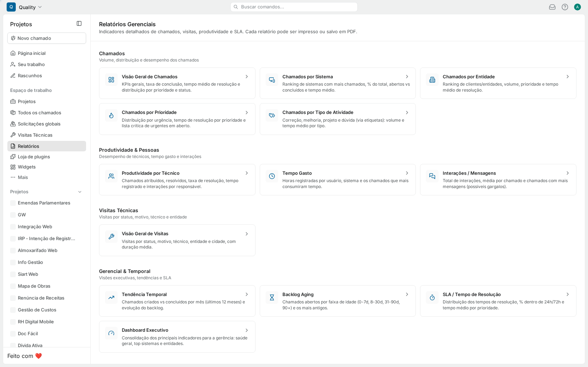

Relatórios gerenciais montados sobre os mesmos dados, prontos para impressão e
envio.

\newpage

# Atendimento (chat e WhatsApp)

O módulo de atendimento conecta o WhatsApp (via Z-API) e um widget de chat para
o site. Cada conversa recebe um **protocolo** e pode virar chamado.

## A tela do atendente

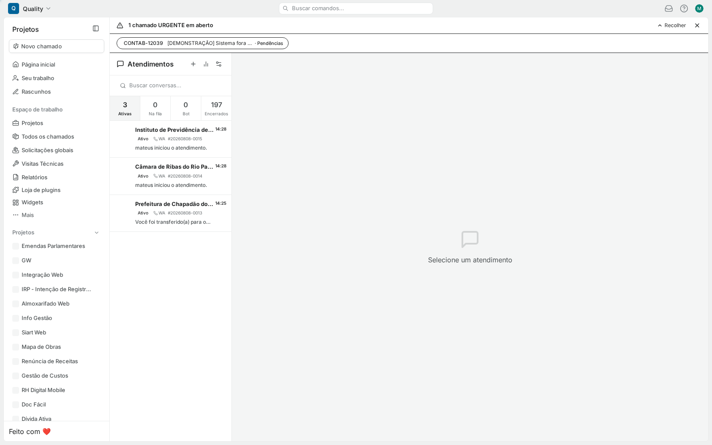

A coluna da esquerda lista as conversas separadas em quatro abas:

| Aba | O que é |
|---|---|
| **Ativas** | Já com um atendente. |
| **Na fila** | O cliente escolheu o assunto e espera atendimento. |
| **Bot** | O robô ainda está conversando (nome, menu). |
| **Encerrados** | Histórico. Aqui estão as conversas migradas do SAC. |

## Uma conversa aberta

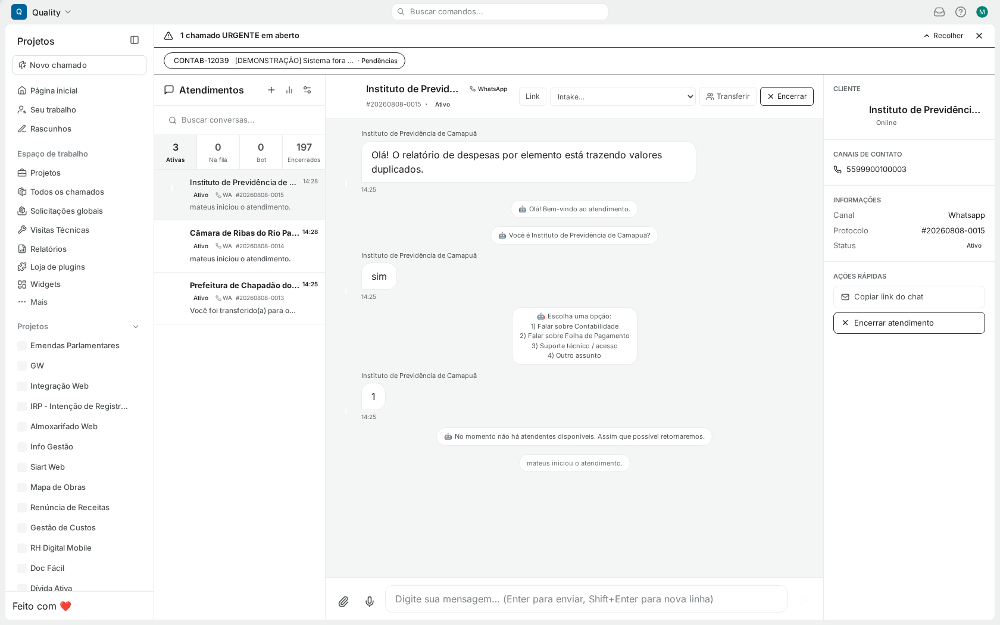

No centro fica o histórico. As mensagens do cliente aparecem à esquerda, as do
robô e do atendente à direita. Repare no fluxo completo do bot: saudação →
confirmação do nome → menu de assuntos → encaminhamento para a fila.

No topo: canal (WhatsApp), protocolo, situação, **Link** (para enviar ao
cliente), o seletor de solicitação (transformar em chamado), **Transferir** e
**Encerrar**.

À direita, o painel do cliente: telefone, canal, protocolo, situação e ações
rápidas.

Embaixo, a caixa de resposta, com **anexo** (clipe) e **áudio** (microfone).
`Enter` envia; `Shift + Enter` quebra a linha.

## Painel de atendimento

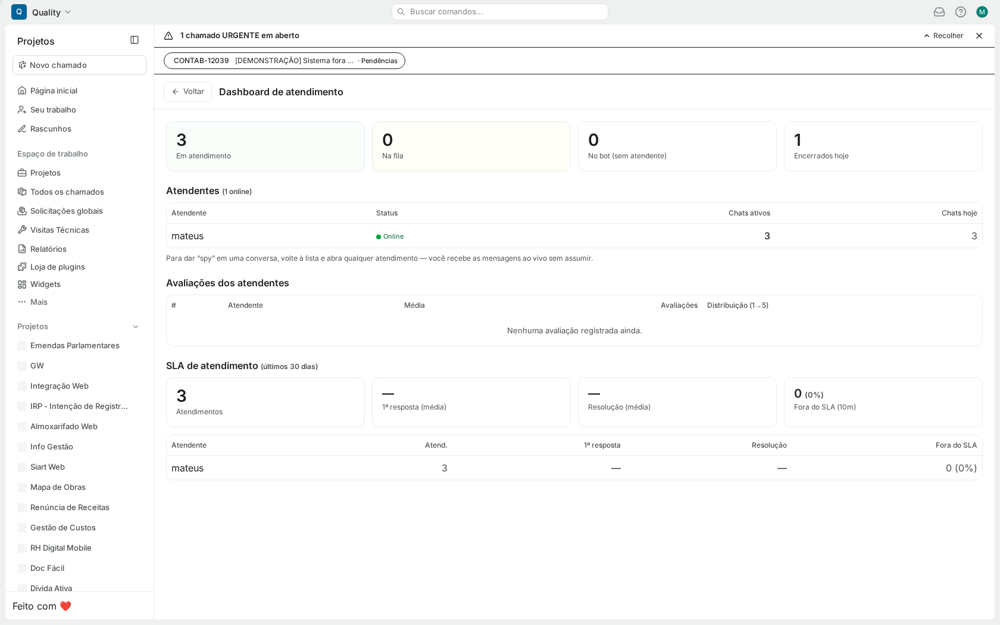

Números do atendimento: volume por período, tempo de espera e distribuição por
atendente.

**Dicas**

- Mensagens podem ser **editadas e apagadas** pelos dois lados; a alteração é
  propagada para o WhatsApp do cliente.
- O histórico do sistema antigo foi migrado inteiro, inclusive os anexos.

\newpage

# Configurar o atendimento

As configurações do atendimento ficam **dentro da própria tela de Atendimento**,
na engrenagem ao lado do título. São seis abas.

## Mensagens

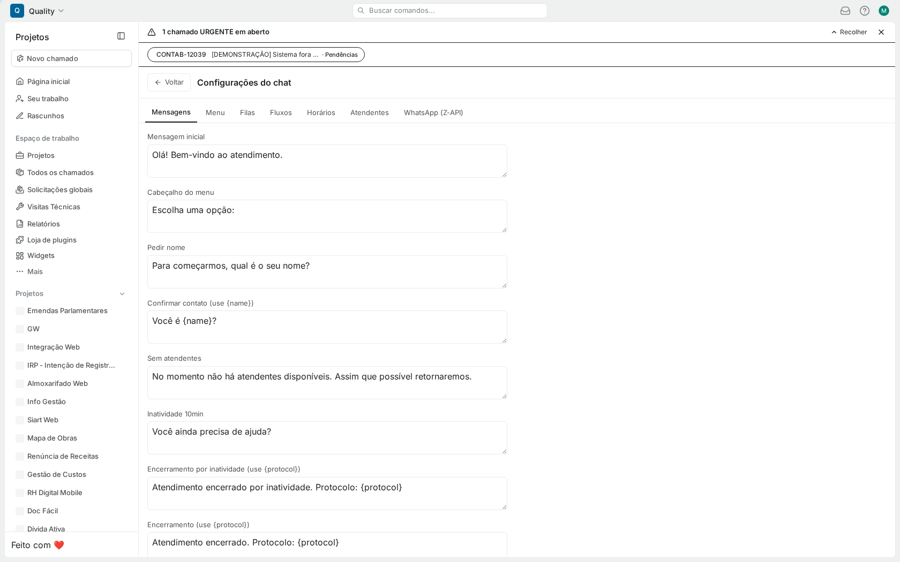

Os textos que o robô envia. Vale revisar todos antes de ligar o canal:

| Mensagem | Quando aparece |
|---|---|
| **Mensagem inicial** | Primeiro contato do cliente. |
| **Cabeçalho do menu** | Antes de listar as opções. |
| **Pedir nome** | Quando o contato ainda não tem nome cadastrado. |
| **Confirmar contato** | Quando já tem — use `{name}` para inserir o nome. |
| **Sem atendentes** | Fora do horário ou sem ninguém disponível. |
| **Inatividade 10 min** | Cutucão quando o cliente some. |
| **Encerramento por inatividade** | Fechamento automático — use `{protocol}`. |
| **Encerramento** | Quando o atendente encerra — use `{protocol}`. |

## Menu

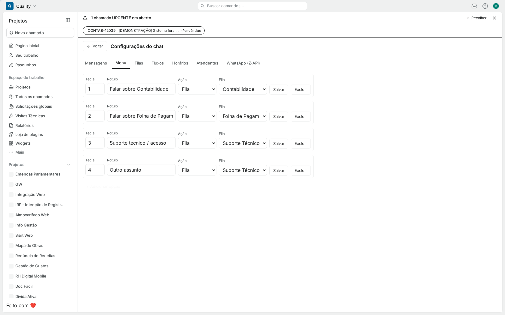

As opções que o cliente escolhe digitando um número. Cada linha tem:

- **Chave** — o número que o cliente digita (1, 2, 3…). **Sem chave a opção não
  funciona**: o robô responde "opção inválida" a qualquer resposta.
- **Rótulo** — o texto mostrado.
- **Ação** e **Fila** — para onde a conversa vai ao escolher aquela opção.

## Filas

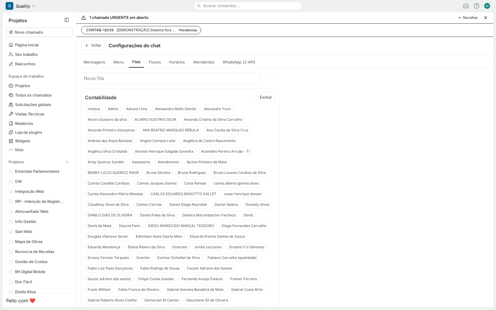

Uma fila por assunto (Contabilidade, Folha de Pagamento, Suporte Técnico…), com
os atendentes de cada uma. A conversa entra na fila escolhida no menu e é
distribuída entre quem está disponível.

## Fluxos

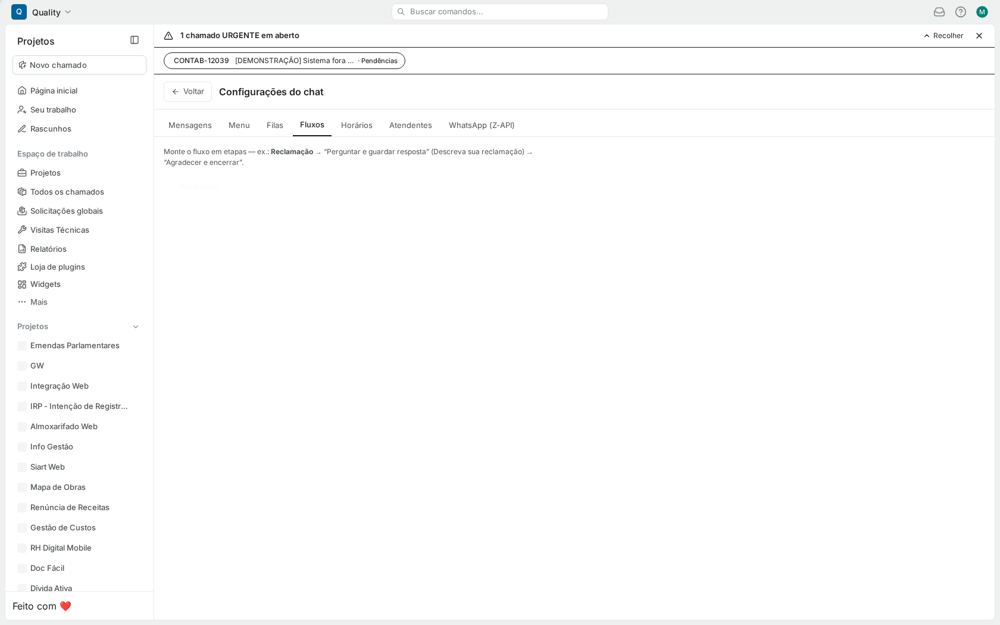

Sequências de perguntas para casos que sempre pedem os mesmos dados antes de
chegar ao atendente.

## Horários

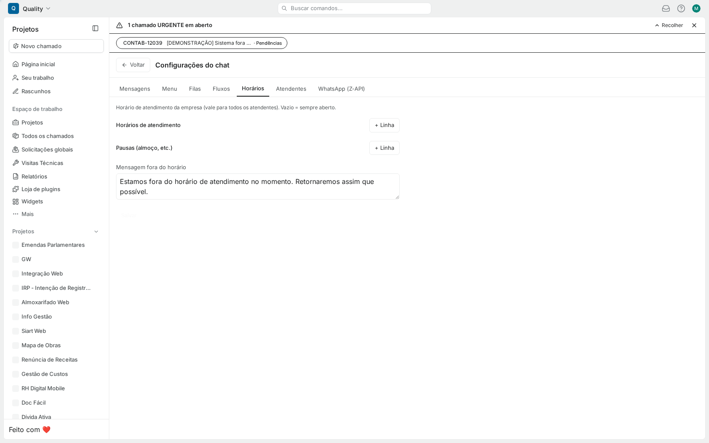

Horário de atendimento e intervalos. Fora dele, o robô responde a mensagem de
"sem atendentes" em vez de deixar o cliente esperando.

## WhatsApp (Z-API)

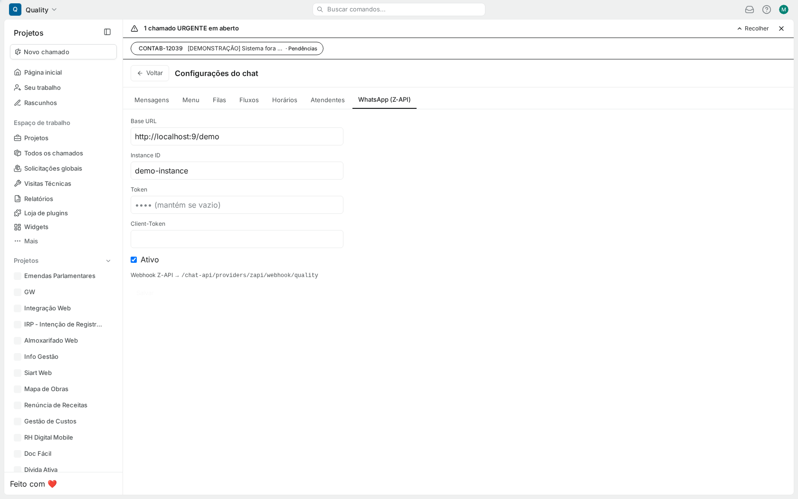

As credenciais da instância Z-API: identificador, token, token do cliente e URL.
O interruptor **ativo** é o que liga a entrada de mensagens — com ele desligado
o sistema aceita o webhook e não faz nada.

> A tela **Configurações → Atendimento (Chat)** é outra coisa: ela só liga o
> plugin e guarda os endereços do serviço de chat.

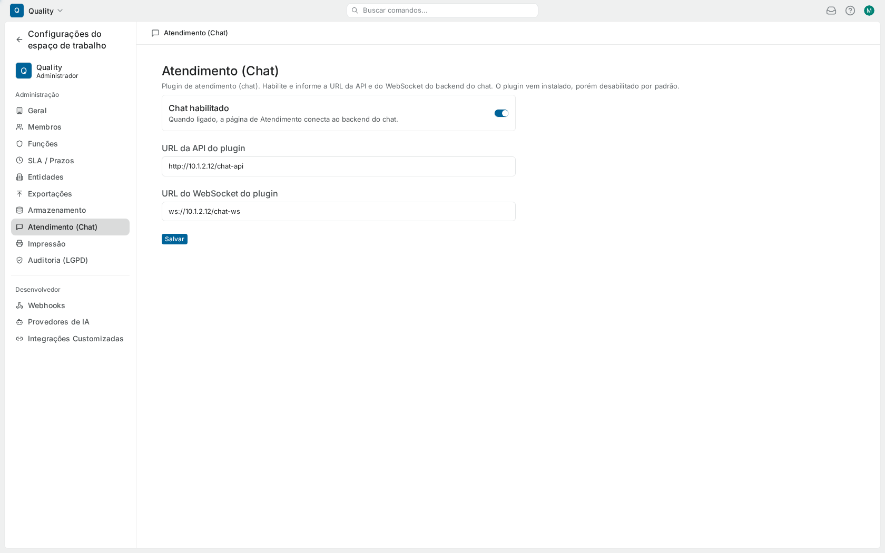

\newpage

# Notificações, rascunhos, notas e páginas

## Notificações

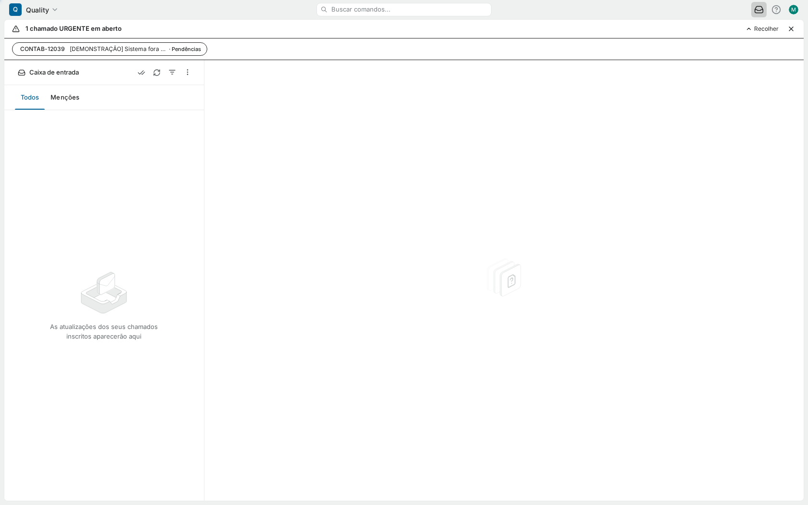

Menções, atribuições e mudanças nos chamados que você acompanha. Atualiza em
tempo real, sem recarregar a página.

## Rascunhos

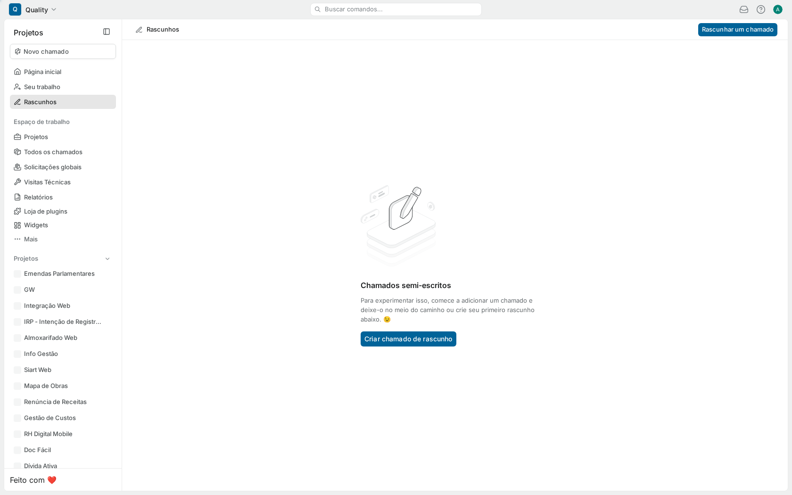

Chamados começados e não publicados. Só você vê.

## Notas rápidas

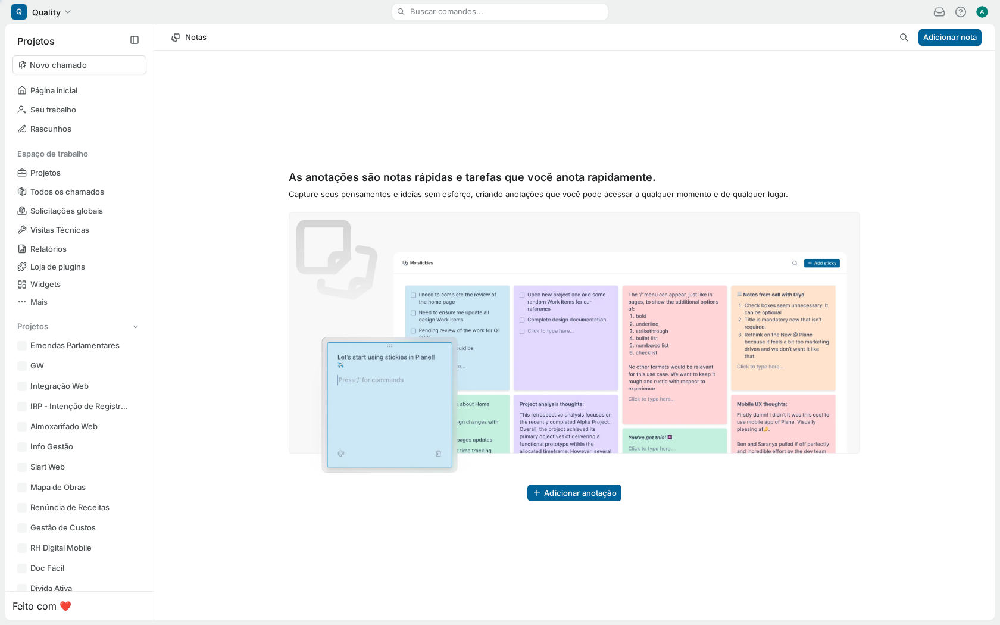

Um mural pessoal de lembretes.

## Páginas

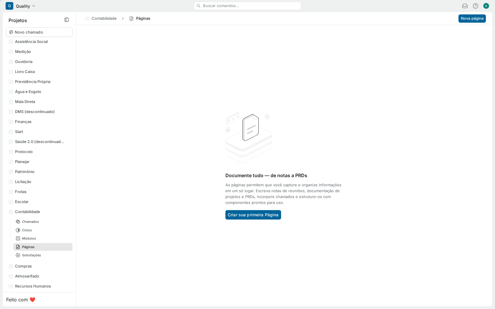

Documentação viva dentro do sistema: procedimentos, roteiros de teste, decisões
técnicas. Ficam dentro do sistema a que pertencem.

\newpage

# Configurações do sistema

Abertas em **Configurações → Sistemas → (nome do sistema)**.

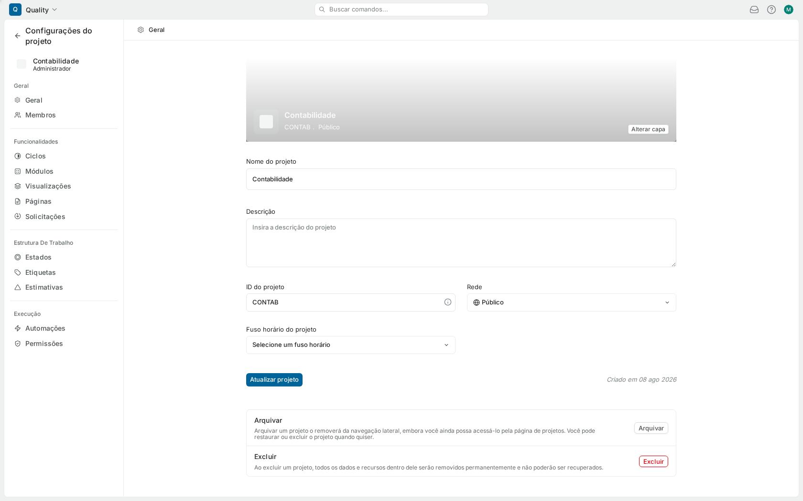

Nome, identificador (a sigla que prefixa os chamados), descrição, capa e
funcionalidades ligadas.

## Membros

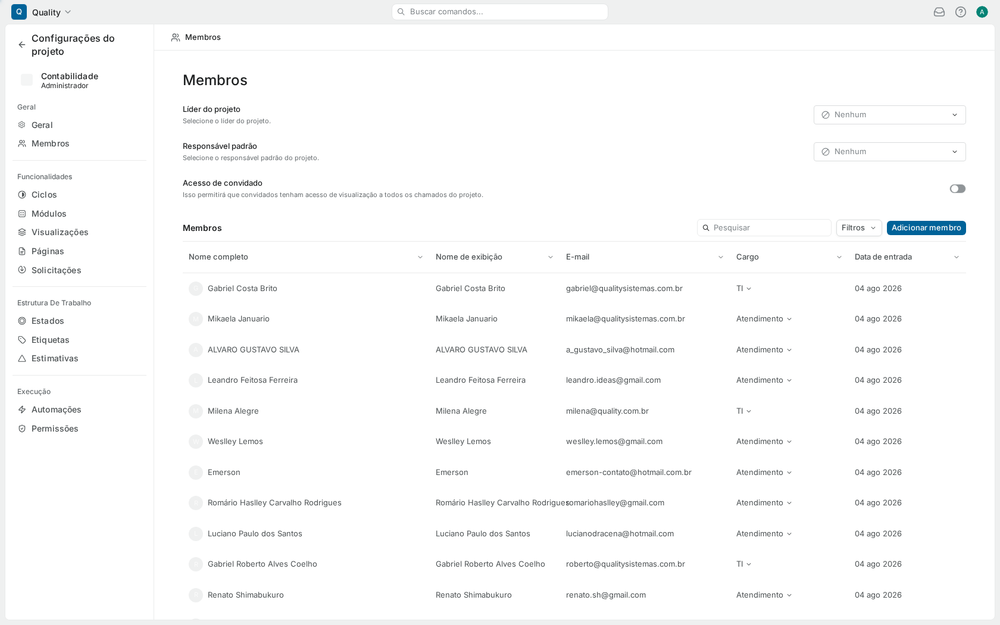

Quem participa e com qual papel. O papel definido aqui vale **dentro deste
sistema**.

## Etapas

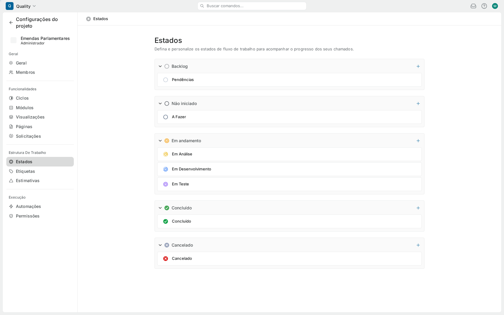

As colunas do quadro. Cada etapa pertence a um **grupo** — Backlog, Não
iniciado, Em andamento, Concluído ou Cancelado. É o grupo, e não o nome da
etapa, que o sistema usa para calcular indicadores e permissões de movimentação;
por isso criar uma etapa nova exige escolher a que grupo ela pertence.

> **A Triagem não aparece nesta tela.** Ela é a etapa de entrada e é o próprio
> sistema que a administra, junto com as solicitações — não dá para renomeá-la
> nem removê-la.

## Etiquetas

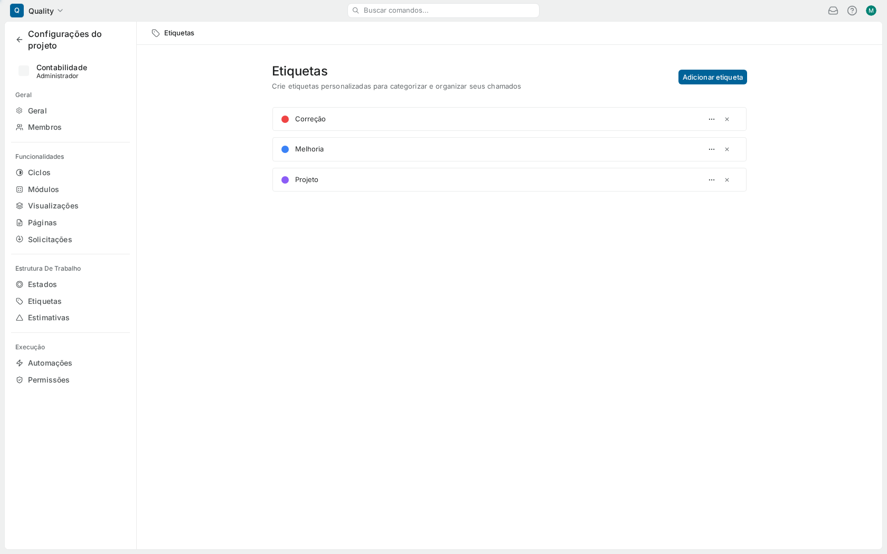

As etiquetas do sistema. São elas que definem o prazo automático — veja
[SLA](#sla--prazos).

## Estimativas


Escalas de esforço para os chamados.

## Automações


Regras automáticas, como arquivar chamado concluído há muito tempo.

## Funcionalidades


Liga e desliga ciclos, módulos, visualizações, páginas e solicitações por
sistema. Sistema que não usa ciclos fica com a tela mais limpa.

\newpage

# Configurações do espaço de trabalho


Nome, identificador e capa do espaço de trabalho.

## Membros


Todos os usuários e seus papéis. É aqui que se convida gente nova e se redefine
senha.

## Funções e permissões


O coração do controle de acesso. À esquerda, as funções em ordem de hierarquia —
o número no quadradinho é o **nível**, e abaixo do nome aparece quantas
permissões a função tem.

À direita, as **permissões agrupadas por assunto**: Chamados, Responsáveis e
etapas, Comentários, Anexos, Solicitações, Organização do trabalho e
Administração do sistema. Cada bloco mostra o contador (`3/6`) e um atalho
**Marcar todas**.

Abaixo vêm as **transições de etapa permitidas**: de onde para onde a função
pode mover um chamado. Sem nenhuma linha, ela não move nada por tabela — quem
precisa de acesso total recebe a permissão *Mover para qualquer etapa*.

As funções de sistema são:

| Função | Nível | Papel |
|---|---|---|
| **Visualizador** | 5 | Só lê |
| **Atendimento** | 6 | Abre solicitação e comenta; não cria nem edita chamado |
| **Qualidade** | 8 | Tira da Triagem, analisa e testa |
| **TI** | 12 | Desenvolve: A Fazer → Em Desenvolvimento → Em Teste |
| **Membro** | 15 | Participação geral |
| **Gestor de Projeto** | 18 | Move livremente entre etapas |
| **Administrador** | 20 | Tudo |

> **Visibilidade ≠ movimentação.** Todo participante do sistema **vê** todos os
> chamados em qualquer etapa. O que a função controla é o que ele pode **mover**.

## Entidades


O cadastro de clientes (269 entidades migradas do SAC). A entidade aparece em
cada chamado e é um dos filtros mais usados: "tudo que a Prefeitura de X abriu".

## SLA / Prazos {#sla--prazos}


O prazo é calculado em duas partes:

1. **Prazo por etiqueta** — cada etiqueta define um prazo-base em horas
   corridas. No exemplo: *Correção* = 16 h, *Melhoria* = 96 h (4 dias),
   *Projeto* = sem prazo.
2. **Ajuste por prioridade** — soma ou subtrai horas do prazo-base. No exemplo:
   Urgente −8 h, Alta −4 h, Baixa +8 h.

Ao aplicar uma etiqueta com prazo, a data de vencimento é preenchida
automaticamente **se ainda não houver uma**. Data informada à mão nunca é
sobrescrita.

## Impressão


Define o logo, o texto do cabeçalho, o texto do rodapé e se a data/hora de
geração aparece. Vale para **tudo** que o sistema imprime: chamados, listagens,
solicitações, ciclos, módulos, visitas técnicas e relatórios. A prévia mostra o
resultado antes de salvar.

> Envie o logo em PNG ou SVG com fundo transparente, altura mínima de 96 px.

## Auditoria (LGPD)


Registro de quem acessou, alterou, imprimiu ou exportou dados. Cada linha traz
data e hora, usuário, **IP de origem**, ação e o registro afetado; alterações
guardam o antes e o depois.

Filtre por ação, tipo de registro, e-mail e período, e exporte em **CSV** — a
própria exportação também é registrada.

> **Direito do titular (art. 18 da LGPD).** Qualquer usuário pode consultar os
> **próprios** acessos, mesmo sem ser administrador. A trilha de terceiros é
> restrita a administradores.

## Armazenamento


Onde os anexos ficam guardados (disco local ou S3).

## Exportações


Exportação em massa dos chamados, por sistema.

## Webhooks


Dispara chamadas HTTP para sistemas externos quando algo acontece (chamado
criado, comentário, mudança de etapa).

## Provedores de IA


Credenciais do assistente que alimenta o botão *Melhorar com IA* na descrição e
nos comentários. Sem nenhum provedor cadastrado aqui, o botão recorre à IA de
levantamento de requisitos do próprio Avião, quando ela estiver configurada.

## Integrações customizadas


Integrações escritas sob medida para o espaço de trabalho.

## Sistemas


A lista de sistemas com atalho para as configurações de cada um.

\newpage

# Plugins e widgets


O Avião aceita extensões: integrações, temas de quadro, importadores, chamados
recorrentes. Instaladas por administradores, podem contribuir com telas próprias
na barra lateral.


A página de widgets documenta as permissões que um widget pode pedir e como
publicá-lo.

\newpage

# Seu perfil


Nome de exibição, avatar e **fuso horário** — este último muda como as datas
aparecem para você, o que importa para quem atende clientes em outros estados.

## Segurança


Troca de senha.

## Notificações


O que você quer receber e por onde.

## Preferências


Tema (claro/escuro) e idioma.

## Tokens de API


Para integrar o Avião a outros sistemas. Defina prazo de validade sempre que
possível — um token sem validade é uma senha que nunca expira.

\newpage

# God-mode: o painel da instância

O god-mode é a administração da **instalação**, não do dia a dia. Fica em
`http://10.1.2.12/god-mode` e só abre para administradores da instância.


Ele tem **login próprio**: a sessão do aplicativo não vale automaticamente lá.

## Geral


Nome da instância, e-mail do administrador, ID da instalação e o interruptor de
telemetria.

## Espaços de trabalho


Todos os espaços de trabalho da instalação. Aqui se cria um novo.

## E-mail (SMTP)


O servidor de e-mail que envia convites, redefinição de senha e notificações.
**Sem SMTP configurado, convite e "esqueci minha senha" não saem** — e o sistema
não avisa em outro lugar.

## Autenticação


As formas de entrar: e-mail e senha, código por e-mail, Google, GitHub, GitLab e
Gitea. É aqui que se decide se alguém pode criar conta sozinho.

## Inteligência artificial


A chave da OpenAI usada pelos recursos de IA.

## Imagens


Libera o banco de imagens de capa usado em projetos e espaços de trabalho.

\newpage

# Atalhos e macetes

## Busca global

A caixa **Buscar comandos…** no topo (ou `Ctrl/⌘ + K`) procura em tudo:

- parte do **título** de um chamado;
- o **código do Avião** (`CONTAB-102`);
- o **número do SAC antigo** no formato `#1234-2026`;
- solicitações, e também navega direto para telas.

## Teclado

| Atalho | Ação |
|---|---|
| `Ctrl/⌘ + K` | Busca global e paleta de comandos |
| `Enter` | Avança na tela de entrada; envia no chat |
| `Shift + Enter` | Quebra linha no chat |
| `Ctrl/⌘ + V` | Cola imagem direto na descrição ou no comentário |
| `/` | Menu de blocos dentro do editor |
| `@` | Menciona alguém |
| `Esc` | Fecha menus, filtros e janelas |

O menu **?** → *Atalhos de teclado* lista o conjunto completo.

## No dia a dia

- **Edite pela lista.** Estado, prioridade, responsável, prazo e entidade são
  editáveis direto na linha ou no cartão do kanban.
- **Modelos em vez de decorar filtro.** Um clique em *Modelos* devolve o recorte
  do seu setor; os interruptores tiram dele o trabalho dos outros.
- **O número velho continua valendo.** Use-o para falar com quem ainda pensa
  pelo número do SAC.
- **Imprima com filtro aplicado.** A impressão respeita o que está na tela.
- **Cole o print direto.** Não salve o arquivo antes: `Ctrl + V` dentro da
  descrição resolve.
- **Tempo real.** Chamados, comentários, solicitações e conversas atualizam
  sozinhos.
- **Você é auditado — e isso protege você.** Visualização, edição, impressão e
  exportação ficam registradas com IP.

\newpage

# Perguntas frequentes

**Não vejo um sistema na barra lateral.**
Você não é membro dele. Peça acesso em *Configurações → Membros*.

**Não consigo arrastar o chamado para outra coluna.**
A movimentação depende da sua função. Confira em *Configurações → Funções* quais
transições o seu papel permite.

**A listagem está vazia.**
Quase sempre é filtro ativo. Confira se **Meus chamados** ou **Abertos por mim**
estão ligados (ficam azuis) e limpe a barra de filtros.

**Um chamado está em Triagem mas alguém já cuida dele.**
Triagem significa "sem responsável da Qualidade". Entre como responsável e ele
sai da fila — e tirar o responsável devolve o chamado para a Triagem.

**Um chamado antigo não tem responsável.**
O SAC nem sempre registrava quem estava com o chamado, e quem saiu da empresa
não foi migrado. Chamados que estavam com o cliente ou com o representante
também chegaram sem responsável.

**Onde estão os chamados antigos do SAC?**
Todos migraram: 50.966 chamados, 191.836 comentários, 861 visitas, 65.721 anexos
e 104.657 conversas de chat. Procure pelo número antigo na busca global.

**Por que um comentário diz "há cerca de 18 anos"?**
Porque é a data original do SAC. A migração preservou as datas.

**O cliente mandou WhatsApp e nada aconteceu.**
Confira o interruptor **ativo** em *Atendimento → engrenagem → WhatsApp
(Z-API)*. Desligado, o sistema aceita a mensagem e a descarta.

**O robô responde "opção inválida" a tudo.**
As opções do menu estão sem **chave**. Cada uma precisa do número que o cliente
digita.

**Convite e "esqueci minha senha" não chegam.**
Falta configurar o SMTP em *god-mode → E-mail*.

**A tela do god-mode abre em branco.**
O painel foi publicado sem o caminho base. Fale com quem faz o deploy: o build
do admin precisa de `VITE_ADMIN_BASE_PATH=/god-mode`.

**Preciso comprovar quem acessou o dado de um cliente.**
*Configurações → Auditoria (LGPD)*. Filtre por período e registro e exporte o CSV.

**Como coloco a logo da empresa nas impressões?**
*Configurações → Impressão*. Vale para todos os documentos do sistema.
